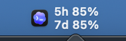

# CodexQuotaBar

一款原生 macOS 菜单栏小工具，直观查看 Codex 的 5 小时与 7 天额度。

## 为什么做它

我在 Codex 里查看用量时，每次都要手动输入斜杠命令。切换到不同会话后，原来打开的用量信息还会消失，想看额度就得再查一次。于是做了这个常驻菜单栏的小工具：抬头就能看到两个额度窗口的剩余比例，点开后再看重置时间和用量变化。

## 界面预览

菜单栏用两行显示 5 小时和 7 天的剩余额度，并使用本机 Codex 应用图标：



点开后的详情页显示剩余进度、重置时间、同一 5 小时窗口内的额度变化，以及额度重置券的可用次数和有效期：


截图展示了真实的额度读数，但不包含用户名、密码或登录令牌。读数会随时间变化。

## 功能

- 菜单栏两行显示 5 小时与 7 天剩余额度，每分钟自动刷新，也可在详情页手动刷新。
- 详情页的进度条长度与“剩余百分比”一致，分别显示两个额度窗口的重置倒计时和具体时间。
- 5 小时卡片显示本轮已用比例；7 天卡片对照显示当前 5 小时窗口内的 7 天额度下降和 5 小时已用比例。
- 显示可用额度重置券次数，并按到期时间列出每张券的有效期。这里的次数是**可使用的重置券**，不是额度窗口自动重置的累计次数。
- Token 区域显示账号累计值与最近可用日期的日汇总。日汇总可能延迟，不代表实时任务消耗，也不能换算成额度百分比。
- 深色模式使用绿色与青柠色提示额度，详情页采用 macOS 原生毛玻璃效果。

## 数据来源

程序通过本机 Codex CLI 的 `app-server` 调用 `account/rateLimits/read` 和 `account/usage/read`。额度百分比、重置时间、重置券次数及有效期来自接口读数。程序不读取或保存登录令牌；Codex 图标从本机已安装的应用资源加载，仓库不包含图标素材。

7 天卡片中的 `7天 −X%` 会在每次 5 小时额度重置后重新建立基线。如果工具在当前窗口开始后才启动，会等到下一次重置后再显示完整一轮的变化。这个数字是同期剩余额度的净变化，可能受到账号其他活动和接口读数精度影响。

## 构建与运行

需要 macOS、Swift 编译器，以及已安装并登录的 Codex 桌面应用或 CLI。

```bash
swiftc -O -framework AppKit -framework SwiftUI CodexQuotaBar.swift -o CodexQuotaBar
./CodexQuotaBar
```

运行后点击菜单栏的图标和读数即可展开详情；点击浮层外部会收起。
