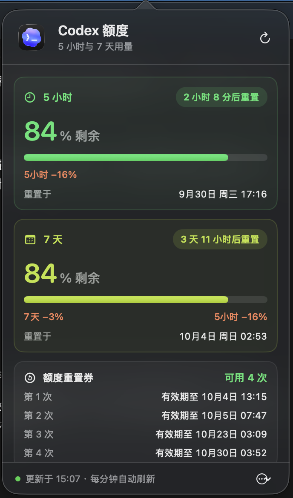

# CodexQuotaBar

一款原生 macOS 菜单栏小工具，直观查看 Codex 的 5 小时与 7 天额度。

## 为什么做它

我在 Codex 里查看用量时，每次都要手动输入斜杠命令。切换到不同会话后，原来打开的用量信息还会消失，想看额度就得再查一次。于是做了这个常驻菜单栏的小工具：抬头就能看到两个额度窗口的剩余比例，点开后再看重置时间和用量变化。

## 界面预览

菜单栏用两行显示 5 小时和 7 天的剩余额度，并使用自绘淡彩渐变六瓣交织额度图标：

当前 1.18 图标和两行额度的放大预览（示例读数）：


点开后的详情页显示剩余进度、重置时间、同一 5 小时窗口内的额度变化，以及额度重置券的可用次数和有效期：



截图展示了真实的额度读数，但不包含用户名、密码或登录令牌。读数会随时间变化。

## 功能

- 菜单栏两行显示 5 小时与 7 天剩余额度，每分钟自动刷新，也可在详情页手动刷新。
- 详情页的进度条长度与“剩余百分比”一致，分别显示两个额度窗口的重置倒计时和具体时间。
- 5 小时卡片显示本轮已用比例；7 天卡片显示当前 5 小时窗口内的 7 天额度下降。
- 显示可用额度重置券次数，并按到期时间列出每张券的有效期。这里的次数是**可使用的重置券**，不是额度窗口自动重置的累计次数。
- Token 区域主要显示今日本机估算，并保留账号累计与注明延迟的云端日汇总。本机统计按系统时区的自然日计算，包含缓存输入，仅覆盖此机器留存的 Codex 会话记录，不能换算成额度百分比。
- 深色模式使用绿色与青柠色提示额度，详情页采用 macOS 原生毛玻璃效果。

## 数据来源

程序通过本机 Codex CLI 的 `app-server` 调用 `account/rateLimits/read` 和 `account/usage/read`。额度百分比、重置时间、重置券次数及有效期来自接口读数。程序不读取或保存登录令牌；Codex 图标从本机已安装的应用资源加载，仓库不包含图标素材。

7 天卡片中的 `7天 −X%` 按实际触发的 5 小时窗口重新计算。每次刷新保存 7 天读数，新窗口开始时采用开始前 120 秒内、同一周额度周期的最近读数作为起点；因此连续使用、没轮询到 0% 时也能续算；窗口结束后等待下次实际使用。基准和闲置记录保存在 `~/Library/Application Support/CodexQuotaBar/comparison.json`，重启后仍可读取。如果工具在当前窗口开始后才启动，会尝试从本机 Codex 会话的额度事件补回同一窗口内 5 小时已用为 0% 时的基准；如果没有这个记录，则等待下一次重置。这个数字是同期剩余额度的净变化，可能受到账号其他活动和接口读数精度影响。

## 构建与运行

需要 macOS、Swift 编译器，以及已安装并登录的 Codex 桌面应用或 CLI。

```bash
swiftc -O -framework AppKit -framework SwiftUI CodexQuotaBar.swift -o CodexQuotaBar
./CodexQuotaBar
```

运行后点击菜单栏的图标和读数即可展开详情；点击浮层外部会收起。

## 排查问题

额度读数、基准恢复结果和读取失败原因记录在 `~/Library/Logs/CodexQuotaBar/quota.log`，日志不记录会话内容或登录令牌，超过 256 KB 后重新开始记录。

## 验证（1.15）

在 macOS 上运行 `python3 test_comparison.py`，使用隔离缓存和模拟额度事件验证：历史基准补回、闲置记录、首次使用触发、重启续算、新窗口归零和过期缓存拒用。测试不会修改正式缓存或读取真实会话。完整程序已通过 Swift 编译验证。

1.15 同时放大菜单栏 Codex 图标至 22 pt，去除图标素材的外部留白，与右侧两行额度信息居中对齐。

1.16 菜单栏改用原生饼图额度图标，颜色随系统主题自动适配，与右侧两行信息居中对齐。

1.17 菜单栏使用接近 ChatGPT 交织样式的六瓣线条图标，以六角留空和额度刻度缺口作区分。

1.18 六瓣额度图标加入低饱和度七彩渐变，额度文字保持系统主题颜色。

1.19 修正 Token 展示口径：今日本机估算逐次累加会话累计值的增量，重复通知和分叉会话的相同历史事件去重，每分钟刷新、当地午夜归零。云端日汇总单独标注日期和延迟，避免被误认为今日实时用量。支持分段日志写入和累计值重置。运行 `python3 test_tokens.py` 验证日期边界、去重、增量读取及缺失日志。

1.20 修复接口重置时间在相差 1 秒的值之间跳动时，7 天减幅基准被误清空的问题。两个额度窗口的重置时间允许 2 秒舍入误差，历史基准恢复采用相同规则；真实的新 5 小时窗口仍重新计算。已增加时间跳动和重启续算回归测试。

1.21 修复连续使用跨越 5 小时窗口时没有 0% 闲置读数、导致同期 7 天减幅缺失的问题。每次读数持久保存供下一轮使用，覆盖重启场景。缺少完整起点时显示已观察到的最小减幅，并标注“至少”，不再隐藏已统计变化。新增连续跨窗、跨窗重启和周额度重置测试。

1.22 将详情页“5小时 −X%”和“7天 −X%”两处减幅文字改为白色，提升深色主题下的可读性。已通过 Swift 编译及本机界面检查。
